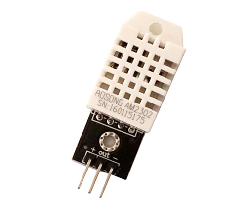
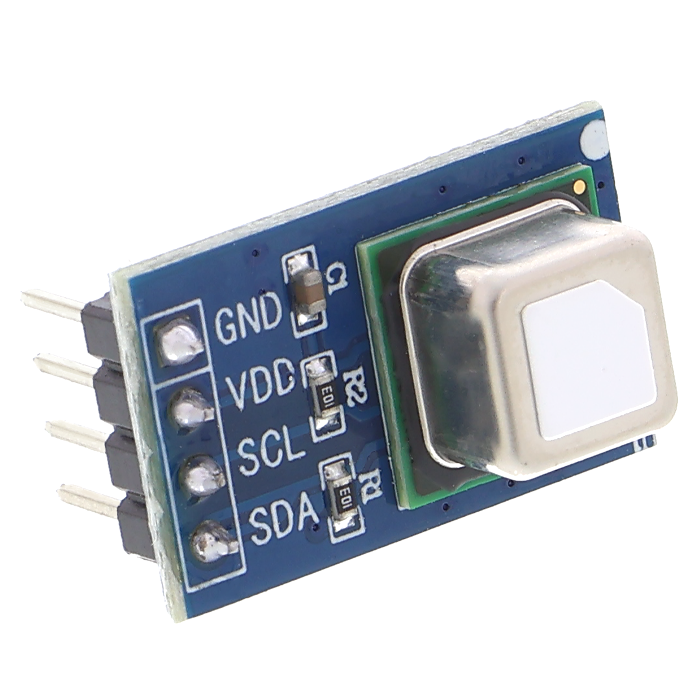
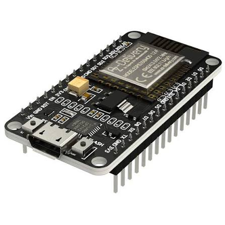
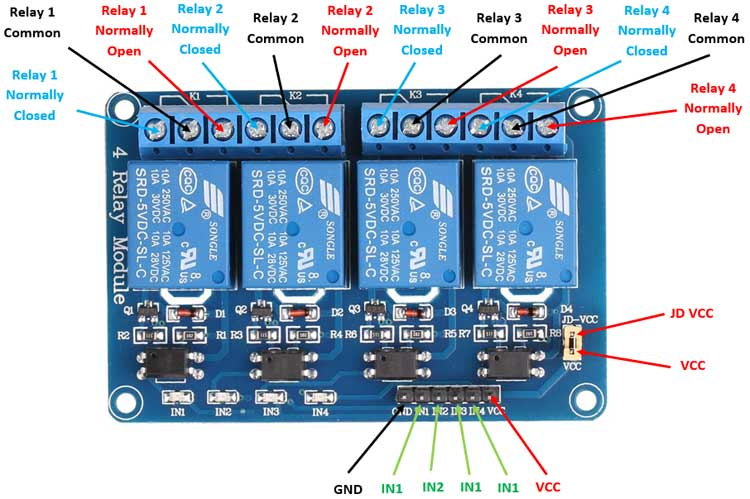

# DIY Mushroom Control Box SE
DIY Super crontrol box Super Easy is based on Tasmota firmware and a bunch of sensor and relay.

Thanks to the amazing open-source project [Tasmota](https://github.com/arendst/tasmota), it is incredibly easy to connect sensors to an ESP8266 or ESP32 and control them using Tasmota rules.

### Why Use Tasmota Rules?
Rules provide a straightforward way to automate grow room activities. For example, you can automatically turn on an extractor fan when $CO_2$ levels exceed 900 ppm. The core logic runs directly on the ESP microcontroller, ensuring reliability without any internet connection. 

Additionally, when connected to Wi-Fi, the device syncs its internal clock, allowing you to use time-based triggers and timers.

### Connectivity & Integration
Tasmota features a built-in web server and an MQTT client to transmit sensor data across your network. This makes it highly compatible with home automation systems, allowing you to:
* View real-time data in **Home Assistant** or **OpenHAB**.
* Store historical data for future research and analysis.
## Hardware Components

* **DHT22 Temperature & Humidity Sensor**
  
* **SCD41 $CO_2$, Temperature & Humidity Sensor**
  
* **ESP8266 NodeMCU Development Board**
  
* **4-Channel 5V Relay Board**
  

## Wiring & Connections

### SCD41 Sensor (I2C Bus)
* **VCC** ➔ NodeMCU **3V3** pin
* **GND** ➔ NodeMCU **GND** pin
* **SCL** ➔ NodeMCU **D1** (GPIO5) pin
* **SDA** ➔ NodeMCU **D2** (GPIO4) pin

The SCD41 is a high-precision, photoacoustic-based $CO_2$ sensor manufactured by Sensirion. Unlike traditional NDIR sensors, its photoacoustic design allows for an incredibly compact form factor without sacrificing accuracy. It provides stable, long-term monitoring of indoor air quality, delivering three critical readings over the I2C bus:
* **$CO_2$ Concentration:** Range from 400 to 5,000 ppm (accuracy of ±40 ppm + 5% of reading).
* **Temperature:** High-accuracy ambient temperature monitoring.
* **Relative Humidity:** Precise humidity tracking, ideal for closed-loop environmental control.


### DHT22 Sensor (Data)
* **Data** ➔ NodeMCU **D5** (GPIO14) pin
* *Note: Power the DHT22 with 3V3 or 5V depending on your specific module breakout. If you are using the bare sensor component, remember to place a 4.7kΩ pull-up resistor between the Data and VCC pins.*

### 4-Channel Relay Module
* **VCC** ➔ NodeMCU **VU (or 5V)** pin *(Note: 4-channel relay modules require a 5V supply to reliably drive the electromagnets).*
* **GND** ➔ NodeMCU **GND** pin
* **IN1** ➔ NodeMCU **D3** (GPIO0) pin
* **IN2** ➔ NodeMCU **D6** (GPIO12) pin
* **IN3** ➔ NodeMCU **D7** (GPIO13) pin
* **IN4** ➔ NodeMCU **D8** (GPIO15) pin *(Note: The D8 pin has an internal pull-down resistor. Ensure your relay board uses Low-Level Trigger logic, otherwise it may interfere with the ESP8266 boot process).*

## Flashing Tasmota

1. Connect your NodeMCU to your computer via a micro-USB cable.
2. Open the [Tasmota Web Installer](https://github.io) in a compatible browser (Chrome, Edge, or Opera).
3. Select **Tasmota All Sensors** from the firmware dropdown list (required for SCD41 support).
4. Click **Install** and select the correct COM port to flash the firmware.

## Firmware Configuration

Once flashed, configure the GPIO pins using the Tasmota web interface or apply the template below.

### GPIO Mapping Table

| NodeMCU Pin | Internal GPIO | Tasmota Component | Associated Function |
| :--- | :--- | :--- | :--- |
| **D1** | GPIO5 | `I2C SCL (1)` | I2C Clock for SCD41 |
| **D2** | GPIO4 | `I2C SDA (1)` | I2C Data for SCD41 |
| **D3** | GPIO0 | `Relay (1)` | Relay 1 Control |
| **D5** | GPIO14 | `AM2301 (1)` | DHT22 Environment Sensor |
| **D6** | GPIO12 | `Relay (2)` | Relay 2 Control |
| **D7** | GPIO13 | `Relay (3)` | Relay 3 Control |
| **D8** | GPIO15 | `Relay (4)` | Relay 4 Control |

### Tasmota Template

Go to **Configuration -> Configure Other** and paste the following string into the **Template** field (make sure to check the **Activate** box):

```json
{"NAME":"GrowMush","ARCH":"ESP8266","GPIO":[224,1,1,1,640,608,1,1,225,226,1216,227,1,1],"FLAG":0,"BASE":18}
```

## Automation Rules

You can inject automation logic directly into the Tasmota console. 

### Humidity Control (Relay 1)
This rule automatically turns on the humidifier (Relay 1) when the humidity drops below 89% and turns it off once it exceeds 92%:

```tasmota
Rule1 ON SCD41#Humidity<89 DO Power1 1 ENDON ON SCD41#Humidity>92 DO Power1 0 ENDON
```

To enable the rule, run this command in the Tasmota console:
```tasmota
Rule1 1
```

## Timer Configuration

Tasmota allows you to set up to 16 independent timers to automate your relays based on time, sunrise, or sunset. For this to work, ensure your NodeMCU is connected to Wi-Fi so it can sync its internal clock via NTP.

### Method 1: Configuration via Web Interface (Recommended)
1. Open the Tasmota web interface and click on **Configuration**.
2. Select **Configure Timers**.
3. Choose a timer (e.g., **Timer 1**) and configure the settings:
   * **Days:** Select the days of the week you want the timer to run (e.g., *Every day*, *Weekdays*, etc.).
   * **Action:** Select `Output` and choose your relay number (e.g., `1` for Relay 1).
   * **Action Mode:** Set to `ON` to start or `OFF` to stop the device.
   * **Time:** Choose between a fixed `Clock` time (e.g., `08:00`) or solar events (`Sunrise` / `Sunset`).
4. Check the **Arm** box to activate the timer.
5. Click **Save**.

### Method 2: Configuration via Console (Quick Setup)
If you want to configure timers instantly or back them up, you can use the Tasmota **Console**. 

Here is an example to turn **Relay 1 ON at 08:00 AM** and **OFF at 08:00 PM** every day:

* **Set Timer 1 (ON at 08:00):**
  ```tasmota
  Timer1 {"Arm":1,"Mode":0,"Time":"08:00","Window":0,"Days":"1111111","Repeat":1,"Output":1,"Action":1}
  ```
* **Set Timer 2 (OFF at 20:00):**
  ```tasmota
  Timer2 {"Arm":1,"Mode":0,"Time":"20:00","Window":0,"Days":"1111111","Repeat":1,"Output":1,"Action":0}
  ```

### Important: Timezone Setup
To make sure your timers trigger at the exact local time, you must configure your timezone in the **Console**. Run the following command (example for Central European Time - CET/CEST):

```tasmota
Timezone 99
```
*Note: `Timezone 99` enables automatic Daylight Saving Time (DST) tracking based on standard European rules. Adjust the offset if you live in a different region.*


## Home Assistant MQTT Integration

Tasmota integrates seamlessly with Home Assistant via MQTT using the native **Tasmota integration** (which utilizes MQTT Discovery).

### 1. Configure MQTT on Tasmota
Navigate to the Tasmota web interface and go to **Configuration -> Configure MQTT**. Fill in the following fields:
* **Host:** Your MQTT Broker IP address (e.g., Home Assistant Raspberry Pi IP).
* **Port:** `1883` (default MQTT port).
* **Client / Topic:** Keep the unique default string or choose a custom one (e.g., `growmush_box`).
* **User:** Your MQTT broker username.
* **Password:** Your MQTT broker password.

Click **Save**. The NodeMCU will reboot and connect to your broker.

### 2. Enable Home Assistant Discovery
To make your sensors and relays automatically appear in Home Assistant, open the Tasmota **Console** and run the following command:
```tasmota
SetOption19 0
```
*Note: Setting `SetOption19 0` ensures Tasmota uses the modern native integration instead of the legacy MQTT discovery.*

### 3. Add to Home Assistant
1. In Home Assistant, go to **Settings -> Devices & Services**.
2. If you already have the **Tasmota Integration** active, your new device will automatically appear there.
3. If not, click **Add Integration**, search for **Tasmota**, and add it. All entities (relays, temperature, humidity, and $CO_2$) will be instantly available.

Or you can configure mqtt topic by hand in configuration.yaml

... stay tuned ... 